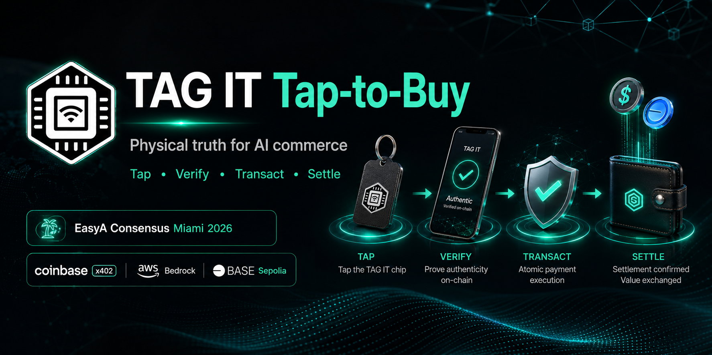

# TAG IT Tap-to-Buy



> Physical truth for AI commerce. Tap, verify, transact, settle — all in seconds.

**Built at EasyA Consensus Hackathon Miami, May 5–7, 2026**
**Tracks**: Coinbase ($5K) + AWS ($40K credits)
**Project lead**: Artemus Prime, Founder & CEO, [TAG IT NETWORK](https://tagit.network)

**Live demo**: [tagit-tap-to-buy.vercel.app/verify/test-chip](https://tagit-tap-to-buy.vercel.app/verify/test-chip)
**OfferEscrow on Base Sepolia**: [`0x213767060F842A7bFF6E3Ce30249eDbd177c02c5`](https://sepolia.basescan.org/address/0x213767060F842A7bFF6E3Ce30249eDbd177c02c5)
**Demo asset**: VT PDRN Capsule Cream 100 — token #5 on Base Sepolia, IPFS metadata `QmZLqbsFDKpHc4BsnP4fVcNd4PEi6JriR9MUmJ9bia6oKQ`

---

## Problem

AI agents are about to spend trillions on physical things — watches, furniture, parts, products. Today they're spending blind. They can't tell real from fake. They can't verify a watch is on a wrist or a chair is in a warehouse.

## Solution

NFC chip + on-chain twin + wallet action layer. Tap a chip, verify in 2 seconds, transact in one tap-confirmed atomic settlement.

## Demo flow

1. **Tap** the VT PDRN Capsule Cream jar with any phone.
2. **Verify** — PWA loads in <2s. AUTHENTIC. ACTIVATED. Owner: `0x458B…`. Reads pulled live from `TAGITCore.getAsset()` on Base Sepolia. ✅ shipped
3. **Connect Wallet** → Coinbase Smart Wallet appears (passkey, no seed phrase). ✅ shipped
4. **Offer 30 USDC** → EIP-712 typed sig + USDC `approve` + `OfferEscrow.fundOffer` lock the funds on Base Sepolia in three sequential wallet pops. ✅ shipped, deployed
5. **Owner accepts** → atomic NFT-and-USDC swap via `acceptOffer`. ✅ contract shipped, owner-side UI is next pass
6. **Pay 1¢** via Coinbase x402 → AI brief from Bedrock. 🟡 backend scaffolded under `api/`, not deployed (cut from hackathon scope to ship L1 + L3 cleanly)
7. **Tap again** — page now shows the buyer as new owner.

## Architecture

```
[NFC Chip] ─tap─► [verify.tagit.network/<chipId>] (PWA)
                       │
   ┌───────────────────┼───────────────────┐
   ▼                   ▼                   ▼
Layer 1            Layer 2            Layer 3
On-chain read      x402 brief         Wallet action
(no wallet)        (1¢ USDC)          (Coinbase Smart Wallet)
   │                   │                   │
[Base Sepolia]    [Lambda]            [OfferEscrow.sol]
[AssetVault]      [Bedrock]                │
                  [S3]                [Atomic settle]
                  [DynamoDB]          [NFT + USDC swap]
```

## Track alignment

### Coinbase ($5K) — ✅ shipped on-chain
- **Smart Wallet** powers Layer 3 (passkey, no seed phrase) — wired in `verify/lib/wallet.ts`, `coinbaseWallet({preference:'smartWalletOnly'})`
- **Base Sepolia** hosts the verified `OfferEscrow.sol` at [`0x213767060F842A7bFF6E3Ce30249eDbd177c02c5`](https://sepolia.basescan.org/address/0x213767060F842A7bFF6E3Ce30249eDbd177c02c5) — settlements happen here
- **x402** middleware scaffolded in `api/middleware/x402.ts` — the brief endpoint is the integration point (deployment cut from hackathon scope, see below)

### AWS ($40K credits) — 🟡 scaffolded
- **Bedrock** opt-in completed for `claude-haiku-4-5` in us-east-1
- Brief endpoint code in `api/src/getBrief.ts` (Bedrock + photo + history)
- Chip resolver code in `api/src/resolveChip.ts` (DynamoDB)
- x402 middleware in `api/middleware/x402.ts` (1¢ USDC paywall validation)
- **AWS deployment cut** to ship L1 + L3 cleanly within the 46-hour window. Code is repo-resident and runnable; Lambda/S3/DDB provisioning is the immediate next milestone.

## Pre-existing TAG IT NETWORK code (used as dependencies)

See [DISCLOSURE.md](./DISCLOSURE.md) for the full reuse manifest required by EasyA hackathon rules.

- TAGITCore lifecycle pattern — `tagit-contracts`
- NTAG 424 DNA SUN verification — `tagit-sdk`
- verify.tagit.network base UX — `tagit-website`
- IPFS pinning patterns — `tagit-services`

## Net-new code built during EasyA Miami (May 5–7, 2026)

**Shipped & deployed:**
- `contracts/src/OfferEscrow.sol` — atomic NFT/USDC settlement, EIP-712 offers, EIP-1271 smart-wallet sigs, monotonic SUN counter for tap-on-receive, timeout refund, cancel. Deployed + verified on Base Sepolia: [`0x213767060F842A7bFF6E3Ce30249eDbd177c02c5`](https://sepolia.basescan.org/address/0x213767060F842A7bFF6E3Ce30249eDbd177c02c5). 13/13 Foundry tests passing.
- `verify/` — three-layer PWA on Next.js 14, deployed at [tagit-tap-to-buy.vercel.app](https://tagit-tap-to-buy.vercel.app). L1 reads asset state live from `TAGITCore.getAsset()`. L3 OfferForm signs EIP-712 typed offers and funds the escrow.
- `verify/app/api/resolve/route.ts` — chip → asset binding resolver (static map for the demo asset; production wires to TAG IT registry).

**Scaffolded, not deployed:**
- `api/src/getBrief.ts` — Bedrock brief endpoint (Claude Haiku 4.5)
- `api/middleware/x402.ts` — 1¢ USDC paywall middleware
- `api/src/resolveChip.ts` — DynamoDB-backed chip resolver
- `infra/seed-demo.ts` — S3 + DynamoDB seed script for metadata layer

## How to run locally

```bash
# Contracts
cd contracts
forge install
forge test -vvv

# Frontend
cd verify
pnpm install
pnpm dev

# API (local SAM)
cd api
sam local start-api
```

## Roadmap (Part Two)

Full e-commerce trust layer + agentic attestation economy. Buyer-agents pay seller-humans for fresh taps. Every chipped item becomes a self-attesting asset. See sibling Notion project: **TAG IT Trust Infrastructure — Agentic Commerce Layer**.

## License

MIT — see [LICENSE](./LICENSE).

## TAG IT NETWORK

Three testnets live (Arbitrum Sepolia, OP Sepolia, Base Sepolia). 12 federated repos. Real chips on real products with real chains and real wallets.

[tagit.network](https://tagit.network)
